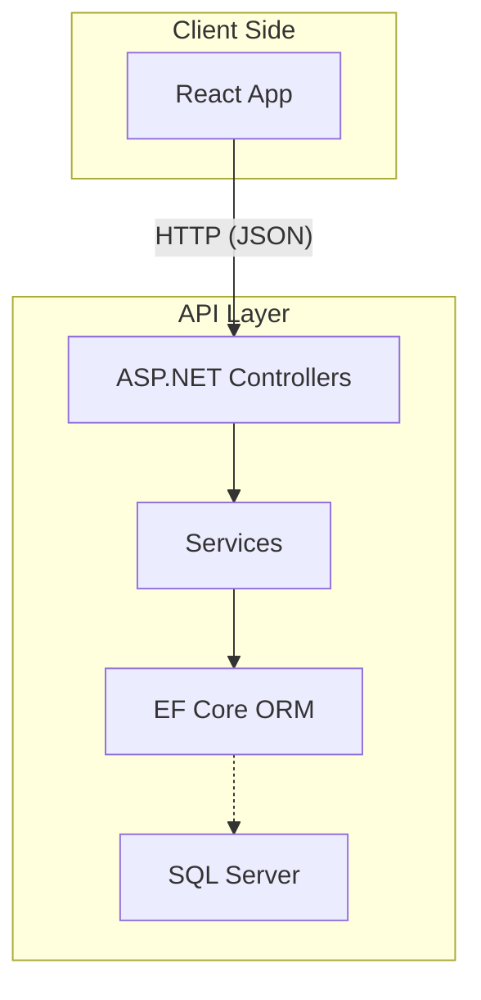

# Course-Management--ASP.NET-and-REACT
# Course Management System 🎓 CODEMY

A modern full-stack **Course Management System** built with **ASP.NET Core** (C#) for the backend and **React** (JavaScript) for the frontend. This project streamlines course creation, enrollment, and learning management for administrators, instructors, and students.

---

## 🚀 Project Overview

This platform enables:
- **Admins** to manage courses and instructors.
- **Instructors** to create, edit, and manage their courses.
- **Students** to browse, enroll, and track course progress.

### 🌟 Key Features

- User Authentication & Role Management (Admin, Instructor, Student)
- Course creation, update, and deletion
- Enrollment management
- Instructor dashboard
- Student progress tracking
- Search & filter courses
- Portfolio-ready, hands-on projects
- Industry-standard tools & best practices

---

## 🛠️ Tech Stack

| Layer      | Tech                              |
|------------|-----------------------------------|
| Frontend   | React, JavaScript, CSS            |
| Backend    | ASP.NET Core (C#), Entity Framework|
| Database   | SQL Server (via EF Core ORM)      |
| Auth       | JWT, Role-based access            |
| Styling    | Custom CSS                        |


---

## 🗂️ Project Structure

```
/frontend    # React application (UI)
/backend     # ASP.NET Core API (business logic, DB access)
```

---

## 🏗️ Entity Relationship Diagram (ERD)

```mermaid
erDiagram
    USER ||--o{ ENROLLMENT : enrolls
    COURSE ||--o{ ENROLLMENT : has
    USER ||--o{ COURSE : teaches
    USER {
      int Id PK
      string Name
      string Email
      string Role (Admin/Instructor/Student)
    }
    COURSE {
      int Id PK
      string Title
      string Description
      string Category
      string Duration
      int InstructorId FK
      datetime CreatedAt
      bool IsActive
    }
    ENROLLMENT {
      int Id PK
      int UserId FK
      int CourseId FK
    }
```

---

## ⚙️ Backend High-Level Diagram



---

## 📚 Example Course Data

- **Title:** Introduction to React
- **Category:** Web Development
- **Duration:** 8 weeks
- **Description:** Learn the basics of React development including components, state, and props.

---

## 🧩 How It Works

### Users & Roles

- **Admins:** Manage all users, instructors, and courses.
- **Instructors:** Create, update, delete their own courses; see enrolled students.
- **Students:** Enroll in courses, track progress, view course material.

### Backend

- RESTful API endpoints for courses, users, enrollments.
- Business logic via Service layer.
- Entity Framework Core for DB access.

### Frontend

- Responsive dashboard for all roles.
- Course listing, detail, and enrollment UI.
- Role-based navigation.

---

## ✨ Sample UI Features

- 📑 Clean, mobile-friendly course lists
- 👨‍🏫 Instructor dashboards
- 🔒 Secure login and registration
- 🔍 Powerful course search and filter

---

## 🤝 Contributing

Contributions are welcome! Please fork the repo and submit a pull request.

---

## 📄 License

MIT

---

*Made with ❤️ using ASP.NET Core & React.*
